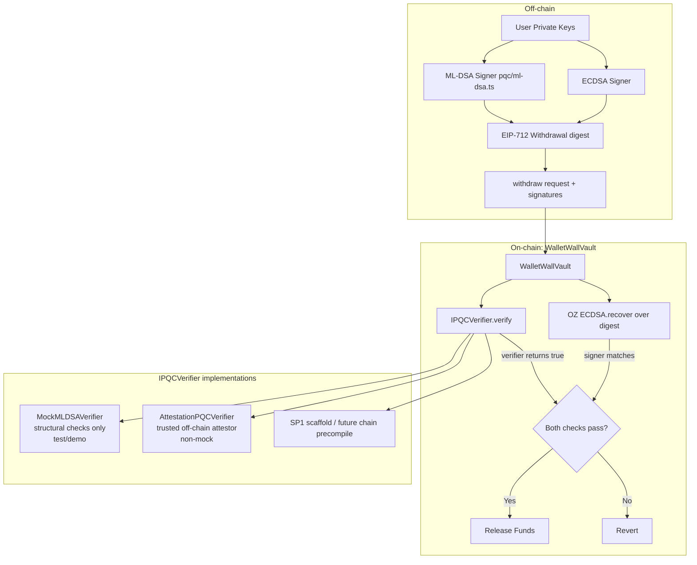

# WalletWall Vault: Architecture Transition

> ⚠️ **Research prototype. Not audited. Do not use real funds.**
>
> **Reading guide:** This document records the architectural transition from an earlier
> WOTS+ prototype to the current ML-DSA design. The historical sections are accurate for
> that transition. For the current implementation, see [../README.md](../README.md) and
> [Security_Assumptions.md](Security_Assumptions.md).
>
> **Current API summary:**
> - The PQ verifier interface is `IPQCVerifier` with
>   `verify(bytes32 digest, bytes publicKey, bytes signature)`.
> - ECDSA is verified inline in `WalletWallVault` using OpenZeppelin ECDSA over the
>   EIP-712 typed `Withdrawal` digest (not via a separate verifier contract).
> - Withdrawals carry an EIP-712 `Withdrawal` struct with `deadline` and `VaultMode`.
> - The active prototype paths are `MockMLDSAVerifier` (test/demo, structural checks
>   only) and `AttestationPQCVerifier` (trusted off-chain attestation, non-mock).
> - An SP1-based verifier exists as an unaudited scaffold/roadmap path. It is not the
>   active Sepolia verifier and does not establish production-grade PQ verification.
> - Native Solidity ML-DSA is not a production path, and chain-native PQ verification
>   remains dependent on future protocol support.
> - `MLDSAVerifier` was renamed to `MockMLDSAVerifier` during the `harden-vault-core`
>   refactor to make its test-only status explicit.

This document describes the transition from the deprecated WOTS+ (Winternitz One-Time Signature) architecture to the new NIST-approved ML-DSA (Dilithium) architecture.

## Before: WOTS+ Architecture

The previous system used WOTS+, which had several limitations:
- **One-time use keys**: Every withdrawal required a new key or a complex Merkle tree management.
- **Large signatures**: WOTS+ signatures consist of many hash chain values.
- **High complexity**: On-chain verification required many hash operations.

### Flow (Before)
1. User generates WOTS+ keypair.
2. User registers WOTS+ public key hash in the Vault.
3. For withdrawal:
   - User provides WOTS+ signature (array of 32-byte hashes).
   - Vault calls a `verifyWOTS` helper.
   - `verifyWOTS` reconstructs the public key from the signature and message, then hashes it.
   - Hash is compared with the stored `pqcPublicKeyHash`.

## After: NIST PQ Architecture (ML-DSA)

The new system uses ML-DSA-65 (Dilithium3), a NIST-approved post-quantum digital signature algorithm.

### Key Improvements:
- **Reusable keys**: ML-DSA keys can be used for many signatures, just like ECDSA.
- **Standardized**: Part of the FIPS 204 standard (formerly CRYSTALS-Dilithium).
- **Hybrid Security**: Built-in support for requiring both ECDSA and PQC signatures.
- **Algorithm Agnostic**: The vault uses an `IPQCVerifier` interface, allowing future
  upgrades to other NIST algorithms (SLH-DSA / FIPS 205, Falcon / FIPS 206) or
  different verification strategies (trusted attestation, ZK proof, precompile).
- **No separate ECDSA verifier contract**: ECDSA is verified inline in `WalletWallVault`
  using OpenZeppelin ECDSA over the EIP-712 digest.

### Flow (After)
1. User generates ML-DSA-65 keypair.
2. User registers the ML-DSA public key in the Vault via `createVault`.
3. For withdrawal, the user builds an EIP-712 `Withdrawal` struct and signs it:
   - ECDSA signature: produced by the registered ECDSA signer over the typed-data digest.
   - PQ signature: produced by the ML-DSA private key over the same typed-data digest.
4. The signed request is submitted to `withdraw` (by the owner or a relayer):
   - `WalletWallVault` verifies the ECDSA signature inline via OpenZeppelin ECDSA.
   - `WalletWallVault` calls `IPQCVerifier.verify(digest, pqPublicKey, pqSignature)`.
   - `MockMLDSAVerifier` performs **structural length checks only** — it does not
     cryptographically bind the signature to the public key or the digest. It is
     test/demo infrastructure, not real security.
   - `AttestationPQCVerifier` (the non-mock path) verifies that a trusted off-chain
     attestor signed an EIP-712 statement attesting ML-DSA verification occurred.
     It does not run ML-DSA on-chain.
   - Replay protection is provided by a strictly-increasing per-owner `nonce` and the
     signed `deadline`.

## Architecture Diagram

## Chosen Algorithm: ML-DSA-65

We chose **ML-DSA-65** (Dilithium3) for this implementation because:
1. **NIST Approval**: It is the primary recommendation by NIST for general-purpose digital signatures.
2. **Performance**: It offers a good balance between signature size (~3.3 KB) and verification speed.
3. **Security**: It provides NIST Security Category 3 (equivalent to AES-192).

### Technical Specs:
- **Public Key Size**: 1952 bytes
- **Signature Size**: 3309 bytes
- **Standard**: FIPS 204
