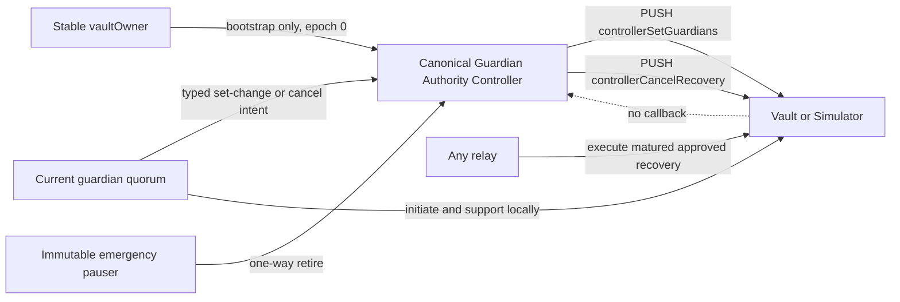

# Guardian Authority Lifecycle — Design

> **RESEARCH PROTOTYPE. NOT AUDITED. TESTNET / LOCAL DEMO ONLY. DO NOT USE WITH REAL FUNDS.**

**Status: v4 — architecture locked for a future implementation lane.** This pull request changes
no production contract. Sections labelled **CURRENT** describe `origin/main` at the anchor below;
sections labelled **TARGET** are proposed behavior and are not yet deployed. The executable design
model is an assurance artifact, not evidence that the production contracts already implement v4.

**Anchor:** `aaba4d2024932ba5fdf131fd9bba5020345af5fb` (`origin/main`, tree
`fbfcdb1638b29d4512cccf2cfdf27f82f972455b`, package `0.13.2`). This is the merge commit for
PR #176, `fix(security): preserve approved recovery requests (#176)`.

---

## 1. Decision

We will move post-bootstrap guardian authority out of the stable `vaultOwner` identity and into a
constructor-fixed, canonical **Guardian Authority Controller**. The controller is a PUSH bridge:
it authenticates the current guardian constituency and calls a small vault-side mutation surface.
The vault never calls the controller during recovery.

The authority rule is deliberately simple:

- while a vault has zero guardians, the stable `vaultOwner` may bootstrap one non-empty set through
  the controller because no independent guardian principal exists yet;
- after bootstrap, only a quorum of the **current guardians** may replace the guardian set;
- only a quorum of the current guardians may cancel a recovery request, before or after recovery
  quorum;
- the stable `vaultOwner`, current spending credentials, contract admin, an individual guardian,
  and a guardian minority have no post-bootstrap replacement or cancellation path;
- a guardian-set change may invalidate an under-supported recovery, but it may not clear a request
  that already reached the current guardian quorum;
- guardian recovery initiation, support, and execution remain local to the vault and simulator,
  with zero external callbacks.

This is a real trust choice, not a way to identify which human party is honest. A malicious
guardian majority remains able to replace the set, cancel a request, or complete recovery. That is
the same majority already trusted to install new spending credentials; v4 makes its self-governance
power explicit. An honest stable owner does **not** retain a permanent veto over that majority.

Under the current constraints, I recommend this architecture because it is the only candidate we
evaluated that satisfies guardian independence, removes the stable-owner recovery veto, preserves
callback-free recovery execution, works symmetrically in both contracts, and fits the measured
vault bytecode budget.

---

## 2. Evidence basis and claim boundary

I re-read the following at the anchor rather than carrying forward v3's source coordinates:

- `contracts/WalletWallVault.sol`;
- `contracts/StablecoinVaultSimulator.sol`;
- `contracts/PolicyControlBridge.sol` and `docs/Policy_Control_Authority_Design.md`;
- `docs/Security_Assumptions.md`;
- guardian, recovery, parity, rotation, structural-assurance, and bytecode tests;
- the EIP-170 and runtime-byte-claim validators.

The evidence set is:

| Evidence | Title | What it establishes |
| --- | --- | --- |
| `E-CURRENT` | Current source at the anchor | The stable owner still owns `setGuardians` and `cancelRecovery`; PR #176 protects quorum-approved requests only from single-guardian replacement. |
| `E-POLICY` | Policy-control bridge and design | Canonical provenance, separate epoch/nonce, action-specific typed intent, and one-way pause are reusable patterns; current-credential authentication is not transferable to guardian authority. |
| `E-MODEL` | `test/GuardianAuthorityLifecycleDesign.test.ts` | The TARGET state machine passes the requested adversarial scenarios and kills the two load-bearing authority mutants. |
| `E-SIZE` | Clean Hardhat compile and disposable spikes | Baseline and two controller-boundary variants were measured directly, then production source was restored and recompiled to baseline. |
| `E-EXISTING` | Existing guardian recovery suites | PR #176's majority-preserving request behavior, simulator parity, rotation precedence, and no-external-call structure are already executable CURRENT properties. |

Observed source behavior, design inference, and target behavior are kept separate below. A passing
model proves internal consistency of the proposed rules. It does not prove that a future Solidity
implementation, signature verifier, deployment, or controller bytecode satisfies them.

---

## 3. CURRENT — principals and authority

The system has several principals that must not be collapsed:

| Principal | Identity | Changes on credential recovery? |
| --- | --- | --- |
| Contract admin | `Ownable2Step.owner()` for the whole deployment | n/a |
| Stable vault owner | the permanent `vaults[]` mapping key | No |
| Current ECDSA signer | `vault.ecdsaSigner` | Yes |
| Current PQ credential | `vault.pqPublicKey` | Yes |
| Individual guardian | one address in `vaultGuardians[owner]` | No |
| Guardian minority | fewer than `(n / 2) + 1` current guardians | No |
| Guardian quorum | at least `(n / 2) + 1` current guardians | No |
| Policy controller | canonical `PolicyControlBridge` for policy subjects | Its credential intents are epoch-invalidated |
| Proposed guardian controller | Does not exist on `main` | n/a |
| Arbitrary caller | any address | n/a |

### 3.1 CURRENT operation matrix

| Operation | Caller / proof | Delay | Replay protection | Rotation effect | Guardian-change effect | Pause |
| --- | --- | --- | --- | --- | --- | --- |
| `setGuardians` | stable owner as `msg.sender` | none | none | survives | writes new set and clears any request/supports | unaffected |
| `initiateRecovery` | one current guardian as `msg.sender` | starts 7-day delay | live-request gate | survives | a set change clears it | blocked |
| `supportRecovery` | one current guardian, once | none | per-owner/per-guardian flag | survives | a set change clears it | unaffected |
| replace matured under-supported request | one current guardian | prior request must mature | replacement resets supports | survives | n/a | blocked |
| replace quorum-approved request | nobody through `initiateRecovery` after PR #176 | n/a | `RecoveryAlreadyApproved` | survives | owner `setGuardians` can still clear it | n/a |
| `executeRecovery` | permissionless relay; guardian support is authority | 7 days | request existence + support count | overwrites credentials and increments nonce/`policyControlEpoch` | set is unchanged | blocked |
| `cancelRecovery` | stable owner as `msg.sender` | none | none | survives | n/a | unaffected |
| `rotateCredentials` | current credentials plus incoming-key proof of possession | none | vault nonce, deadline, typed digest | increments nonce/`policyControlEpoch` | set and recovery survive | blocked |
| `pause` / `unpause` | contract admin | none | none | n/a | no direct mutation | global |

The recovery entrypoints `initiateRecovery`, `supportRecovery`, `executeRecovery`, and
`cancelRecovery` make no external call in either contract. The AST-backed assurance test pins that
property and includes mutation fixtures for typed calls, renamed dependencies, low-level calls,
and inline interface casts.

### 3.2 CURRENT authority defects

#### HIGH-1 — stable-owner compromise controls recovery authority

The stable owner can replace an established set with attacker guardians without approval from the
existing set or current spending credentials. After the normal recovery delay, the attacker can
install attacker-selected credentials. A timelock would add warning but would not remove the stable
owner as sufficient authority.

#### HIGH-6 — stable-owner compromise can veto recovery forever

The same stable owner can call `cancelRecovery()` at any support level, after maturity, while the
vault is paused, and repeatedly across new requests. PR #176 closes guardian-vs-guardian erasure of
an approved request; it intentionally does not restrict this owner path.

#### Stable identity after recovery

Recovery rotates stored credentials but never changes the `vaults[]` key. The recovered credential
therefore cannot exercise current owner-keyed guardian administration, while the original stable
owner retains it. This is not repaired by credential rotation and is why current-credential
authorization is not an adequate substitute.

---

## 4. Locked invariants

### 4.1 `I-GUARDIAN-INDEPENDENCE`

Let `G_e` be the distinct, non-empty guardian set at guardian epoch `e`, and let
`q(G_e) = floor(|G_e| / 2) + 1`.

> Once `e > 0`, no transaction sequence can change `G_e` unless it contains one valid,
> unexpired, unreplayed authorization for that exact transition from at least `q(G_e)` distinct
> members of `G_e`.

This is stronger and more testable than saying an authority is merely "independent":

- stable-owner compromise alone cannot change the set;
- current ECDSA compromise alone cannot change the set;
- current PQ compromise alone cannot change the set;
- simultaneous compromise of the spending credentials still cannot change the set;
- any guardian minority cannot change the set;
- credential rotation and recovery do not invalidate or transfer guardian authority;
- a guardian-epoch change invalidates every old-set authorization.

The immutable controller code is part of the trusted computing base for this invariant. If the
canonical controller is malicious or exploitable, the vault cannot independently reconstruct the
guardian signatures and the invariant fails. We reduce that risk by giving the controller no owner,
no upgrade key, no set-changing admin path, and only an immutable one-way pauser.

### 4.2 `I-RECOVERY-NONVETO`

> The stable owner, spending credentials, contract admin, an individual guardian, and a guardian
> minority cannot erase a recovery request. Cancellation requires `q(G_e)` current guardians and
> is bound to the exact current request, epoch, nonce, consumer, owner, and deadline.

This closes HIGH-6 without pretending cancellation is never useful.

### 4.3 `I-APPROVED-REQUEST-PRESERVATION`

> Once a request has at least `q(G_e)` supports, a guardian-set replacement cannot clear it.
> It may leave only by execution or by a separately authenticated `q(G_e)` cancellation.

An under-supported request may be invalidated by a quorum-authorized guardian-set change. The old
supports are cleared before the new set becomes observable.

### 4.4 `I-GENERATION-BINDING`

> A recovery supported under guardian epoch `e` cannot execute under guardian epoch `e + 1`.

For an under-supported request the set-change transaction deletes the request and support flags
before installing the new set. For an approved request the set change reverts, so its epoch cannot
change underneath it.

### 4.5 `I-REPLAY`

> A consumed guardian-set intent or recovery-cancellation intent cannot be used again, and an
> intent from an old guardian epoch cannot be used in a new epoch.

The controller uses separate monotonically increasing set-change and recovery-action nonces. The
epoch and nonce are separate on purpose: epoch changes authority; nonce orders actions performed by
the same authority.

### 4.6 `I-RECOVERY-LOCALITY`

> Recovery initiation, support, and execution perform zero external calls. Controller failure,
> pause, or retirement cannot make an otherwise valid existing recovery call the controller.

### 4.7 `I-PARITY`

> `WalletWallVault` and `StablecoinVaultSimulator` implement the same guardian-controller and
> recovery state transitions, errors, and authorization semantics.

---

## 5. Why HIGH-6 cannot preserve a unilateral owner veto

The conflict is not solved by relabeling the caller. Consider a quorum-approved request `R` and two
worlds with identical on-chain state:

- in world H, guardians are honest and the stable owner is compromised;
- in world M, guardians are malicious and the stable owner is honest.

If the stable owner can permanently erase `R`, the attacker in world H can veto honest recovery
forever. If the stable owner cannot permanently erase `R`, the owner in world M cannot stop the
guardian majority. The contract cannot distinguish the worlds from the same principals and state.

The same symmetry applies to a permanent spending-credential veto: stolen credentials can veto the
recovery intended to replace them. Requiring both stable owner and credentials is also unreliable:
the two roles may be configured to the same ECDSA key, and a combined compromise remains a permanent
veto. A minority-guardian veto recreates the single-guardian erasure PR #176 removed. A contract-admin
veto creates a global cross-tenant takeover/denial boundary.

We therefore put both positive and negative recovery authority at the same declared trust level:
current guardian quorum. That does not tell us who is honest. It makes the trust model internally
consistent and removes the special stale identity that could overrule it forever.

---

## 6. Candidate architectures

### 6.1 A — stable owner plus timelock

**Verdict: UNSOUND.** A delay, expiry, or grace period can improve notice, but the stable owner is
still sufficient after waiting. A compromised owner can pre-position or repeatedly propose changes,
and recovered credentials remain unable to repair the authority. This candidate fails
`I-GUARDIAN-INDEPENDENCE` by construction.

It is operationally simple and small, so it would be reasonable only if the project explicitly
accepted the stable owner as the permanent recovery root. That is the defect this lane is tasked to
remove.

### 6.2 B — current-credential-signed guardian changes

**Verdict: UNSOUND.** This removes the stable owner from the gate but hands guardian administration
to the credentials recovery exists to replace. A copy-thief can rotate credentials to make their
holding exclusive, replace guardians, and disable the remedy. Lost credentials also leave no
administration path.

The policy-control bridge correctly uses current credentials because policy administration follows
credential authority. Guardian administration must remain independent of that lifecycle, so this is
the Policy Control Bridge lesson we must **not** copy.

### 6.3 C — current-guardian-authorized replacement inside each vault

**Verdict: SOUND WITH CONDITIONS, but not selected as housing.** Existing guardians are the only
established principal that can satisfy the invariant. An in-vault implementation could verify their
signatures or accumulate approvals, maintain epochs/nonces, and apply changes.

What gives me pause is not the authority rule; it is the production vault's size and duplicated
complexity. Signature aggregation, ERC-1271 support, replay state, pause behavior, and two action
types would be duplicated in both already-large contracts. The first disposable spike that kept
more of this state vault-side left only 455 bytes of vault headroom. The authority is sound; the
housing is disproportionate.

### 6.4 D — external canonical Guardian Authority Controller

**Verdict: SOUND WITH CONDITIONS; selected housing.** One immutable controller owns the complex
authentication state and pushes two narrow actions into each consumer. Its conditions are:

- controller address fixed in the vault/simulator constructor;
- no controller owner, upgrade key, arbitrary call, or controller replacement path;
- current-guardian quorum for every established-set change and every recovery cancellation;
- exact consumer/owner/action/set-or-request/epoch/nonce/deadline binding;
- distinct, strictly ordered approvers; EOA and ERC-1271 guardian support;
- success-only nonce/epoch advancement and atomic controller-to-vault application;
- one-way immutable emergency pause that freezes controller mutations but not vault recovery;
- the vault re-validates guardian set shape and approved-request preservation;
- no vault-to-controller callback.

The residual is controller-code concentration: a defect can affect every consumer that names the
same canonical address. Immutable provenance removes key compromise and upgrade drift, but makes a
bug non-repairable in place. Emergency pause contains future mutations; it does not rewrite an
already-established set.

### 6.5 E — hybrid lifecycle authority

**Verdict: SOUND WITH CONDITIONS; selected semantics.** The hybrid is not a mix of permanent owner
and guardian power. It is a state split:

- `UNGUARDED`: stable owner may bootstrap through the canonical controller;
- `GUARDED`: current guardian quorum owns replacement and cancellation;
- recovery execution remains the current local guardian-support path.

Bootstrap owner authority is unavoidable because no guardian exists yet. It ends atomically when
the first set is installed and can never recur for that controller subject. Any hybrid that restores
owner- or credential-only authority after bootstrap is rejected.

### 6.6 Comparison

| Candidate | Security | Reliability | Vault bytes | Migration | Verdict |
| --- | --- | --- | --- | --- | --- |
| A. owner + timelock | owner remains sufficient | simple, but recovery-orphaning persists | small | easiest | **UNSOUND** |
| B. current credentials | stolen/lost credential controls remedy | fails in the failure mode recovery serves | medium | moderate | **UNSOUND** |
| C. guardian logic in vault | correct authority if fully implemented | no external controller dependency | high and duplicated | redeploy | **SOUND WITH CONDITIONS** |
| D. canonical PUSH controller | correct authority; controller code becomes TCB | controller loss freezes administration, not recovery | measured small boundary | redeploy | **SOUND WITH CONDITIONS — SELECTED** |
| E. owner bootstrap / guardian established | matches available principals by lifecycle | bootstrap compromise remains unavoidable | included in D | redeploy | **SOUND WITH CONDITIONS — SELECTED** |
| current behavior | stable owner controls both sides | familiar but HIGH-1/HIGH-6 remain | zero | none | **UNSOUND AS TARGET** |

---

## 7. TARGET — architecture



### 7.1 Canonical provenance

Each vNext vault and simulator constructor receives a non-zero, code-bearing controller address and
stores it as a private immutable. There is no setter, timelock, registry lookup, admin override,
delegatecall, or arbitrary-controller enrollment. A controller revision requires a new consumer
deployment.

The controller itself has no owner or upgrade surface. Its only privileged address is an immutable
`EMERGENCY_PAUSER`, whose only capability is a one-way `pause()`. Pausing blocks bootstrap,
replacement, and recovery-cancellation actions. It cannot unpause, change a set, cancel a recovery,
or affect the vault's local recovery functions.

### 7.2 Controller state

For each `(consumer, vaultOwner)` subject, the controller stores:

```text
initialized
guardianEpoch
guardianSet (or an equivalent enumerable membership representation)
setChangeNonce
recoveryActionNonce
```

The controller is the authority-state owner; the vault stores the operational guardian array used
by recovery. They change in one EVM transaction. The controller updates its state and calls the
vault; a vault revert rolls every controller write back. No asynchronous apply step exists.

### 7.3 Bootstrap

`bootstrap(consumer, owner, initialGuardians)` requires:

- controller not paused;
- caller is the stable `owner` (a Safe works by calling as itself);
- consumer reports an existing vault for `owner`;
- controller subject is pristine and consumer guardian count is zero;
- guardian list is non-empty, at most `MAX_GUARDIANS`, distinct, non-zero, and excludes `owner`.

The controller stores epoch 1 and the list, then pushes it to the consumer. The transaction is
atomic. After success, `initialized` is absorbing; the stable owner has no path back to bootstrap.
The stable mapping key still retains the CURRENT non-guardian roles this lane does not redesign —
deposit attribution, pending-withdrawal finalization/cancellation, and treasury-quorum configuration
— but it has no established-set, recovery-cancellation, controller-enrollment, or controller-pause
authority.

### 7.4 Established-set replacement

Every approver signs the same EIP-712 intent:

```text
GuardianSetChange(
  consumer,
  owner,
  newGuardianSetHash,
  guardianEpoch,
  setChangeNonce,
  deadline
)
```

The calldata carries the complete new guardian list and signer/signature pairs. The controller:

- checks the exact action typehash, chain/domain, consumer, owner, epoch, nonce, and deadline;
- hashes the canonical new list and compares it with `newGuardianSetHash`;
- validates set shape independently of the vault;
- requires signer addresses in strict ascending order, which proves distinctness cheaply;
- verifies each signer is in the controller's current set;
- verifies EOA signatures and ERC-1271 contract-guardian signatures;
- uses a reentrancy guard and treats a reverting or malformed ERC-1271 response as an invalid
  signature rather than letting one omitted guardian block other quorum combinations;
- requires at least `q(G_e)` valid signers;
- advances the set nonce and epoch, stores the new set, and calls the consumer atomically.

There is no replacement timelock or proposal grace period. The authorizing principal is already the
current recovery quorum; delay creates notice but no new veto. The signature deadline prevents
banking an intent indefinitely. Recovery still requires its existing seven-day delay before new
credentials can take effect.

### 7.5 Recovery cancellation

Cancellation uses a distinct typed action and nonce:

```text
RecoveryCancel(
  consumer,
  owner,
  recoveryId,
  guardianEpoch,
  recoveryActionNonce,
  deadline
)
```

`recoveryId` binds the request target signer, hash of the target PQ key, `executeAfter`, owner,
consumer, and guardian epoch. Mutable support count is deliberately excluded: additional honest
support must not invalidate already-collected cancellation signatures. Before pushing the cancel,
the controller reads the current request and rejects a mismatched ID.

The same current-guardian quorum and signature rules apply before and after recovery quorum and
maturity. The stable owner has no cancel selector. A minority cannot cancel. Cancellation does not
change the guardian epoch; it consumes only `recoveryActionNonce`.

### 7.6 Minimal consumer surface

The implementation lane should keep the consumer changes equivalent to:

```text
immutable GUARDIAN_AUTHORITY_CONTROLLER
controllerSetGuardians(owner, newGuardians)
controllerCancelRecovery(owner)
```

Both entrypoints check `msg.sender` against the immutable controller. The vault repeats set-shape,
treasury-threshold, support-clearing, and request-preservation checks rather than trusting the
controller to preserve local invariants.

`controllerSetGuardians` behavior is:

- no request: replace the set;
- under-supported request: delete it and clear old supports before replacing the set;
- quorum-approved request, whether live or matured: revert `RecoveryAlreadyApproved`;
- pending treasury withdrawal: clear old-set approvals exactly as CURRENT behavior does;
- armed treasury threshold above the proposed new count: revert.

`controllerCancelRecovery` deletes the exact current request and clears supports. Authentication
of the signed `recoveryId` stays in the controller; the vault authenticates canonical provenance.

### 7.7 Why Policy Control Bridge concepts do and do not transfer

| Policy-control concept | Guardian decision |
| --- | --- |
| immutable canonical provenance | **Transfer.** Prevents arbitrary controller enrollment from recreating HIGH-1. |
| action-specific EIP-712 intent | **Transfer.** Set change and cancellation cannot be relabeled. |
| authority epoch plus dedicated nonce | **Transfer.** Guardian epoch invalidates old constituencies; separate nonces prevent replay. |
| intent deadline | **Transfer.** Prevents banked signatures. |
| weakening vs strengthening | **Do not transfer.** Guardian sets have no safe total order; addition can dilute and removal can self-entrench. Every change needs quorum. |
| current-credential authentication | **Do not transfer.** It violates guardian independence. |
| `policyControlEpoch` | **Do not reuse.** Credential epoch and guardian epoch represent different principals. |
| one-way emergency pause | **Transfer with narrow scope.** It retires controller mutations, never local recovery. |
| external callback from the vault | **Do not transfer.** The controller pushes; the recovery path never pulls. |

---

## 8. TARGET recovery lifecycle

| State | Replacement authority | Cancellation authority | Execution | Pause effect |
| --- | --- | --- | --- | --- |
| no request | guardian quorum may replace set | n/a | n/a | vault pause does not govern controller; controller pause freezes admin |
| proposed, zero support | guardian quorum may replace set and thereby invalidate request | guardian quorum | not executable | vault pause blocks new proposal, not controller cancel |
| supported below quorum | guardian quorum may replace set and invalidate request | guardian quorum | not executable | support still accrues while vault paused |
| quorum-approved before maturity | set replacement blocked | guardian quorum | waits for `executeAfter` | request survives vault pause |
| matured below quorum | guardian may replace request under PR #176 rules; guardian quorum may replace set | guardian quorum | insufficient support | initiate/execute blocked while vault paused |
| matured and quorum-approved / awaiting execution | set replacement blocked | guardian quorum | permissionless relay | execution resumes intact after unpause |
| controller paused | guardian set frozen | controller-mediated cancellation frozen | existing local recovery unaffected | one-way controller retirement |

Credential rotation does not cancel recovery, change guardian epoch, change controller nonces, or
change the guardian set. A guardian authorization signed before credential rotation or successful
recovery remains valid until its own deadline, nonce consumption, controller pause, or guardian
epoch change. This is intentional independence, not stale-credential acceptance.

The global contract admin can still pause recovery execution indefinitely. That is a separate,
existing cross-tenant liveness assumption. The admin cannot replace guardians or cancel requests in
the target design.

---

## 9. Adversarial principal matrix

| Compromised / malicious principal | TARGET capability | Cannot do | Disposition |
| --- | --- | --- | --- |
| stable owner | malicious bootstrap while set is zero; existing owner-keyed non-guardian operations | replace established set; cancel recovery | bootstrap limit accepted; HIGH-1/HIGH-6 closed post-bootstrap |
| current ECDSA signer | sign spending/rotation actions allowed by mode | guardian replacement or cancellation | independent |
| current PQ credential | sign spending/rotation actions allowed by mode | guardian replacement or cancellation | independent |
| both spending credentials | rotate/spend as current rules allow | guardian replacement or cancellation | independent |
| one guardian | propose/support recovery; sign one controller intent | reach replacement/cancel quorum alone unless `n=1` | accepted threshold behavior |
| guardian minority | coordinate below threshold | replace/cancel | rejected by controller |
| guardian majority | replace set, cancel request, complete recovery | bypass seven-day recovery execution delay | accepted social-recovery root |
| contract admin | pause/unpause vault; existing global governance | guardian replacement/cancel | separate global liveness risk |
| emergency pauser | permanently freeze controller mutations | change set, cancel request, stop local recovery | accepted fail-closed DoS capability |
| arbitrary caller | relay public controller or recovery calls with valid proofs | manufacture proofs or spoof controller provenance | no authority |
| malicious canonical controller code | push an unauthorized set/cancel because consumer trusts its address | n/a | critical TCB risk; immutable/no-admin design and separate implementation review required |

For `n=1`, the sole guardian is the quorum. It can self-replace, cancel, and recover. That is not a
controller bug; it is the explicit consequence of choosing one guardian at bootstrap. Thresholds
remain `1→1`, `2→2`, `3→2`, `4→3`, `5→3`, and `32→17`.

---

## 10. Migration and compatibility

`WalletWallVault` and `StablecoinVaultSimulator` are non-upgradeable deployments. The v4 controller
cannot be attached safely to existing bytecode, and an arbitrary owner-selected adoption function
would recreate HIGH-1. Therefore the locked migration rule is **no in-place adoption**.

| Existing state | Migration behavior |
| --- | --- |
| zero guardians on a new vNext consumer | stable owner bootstraps once through the canonical controller |
| established set on legacy v0.13.2 | remains on legacy authority; no controller adoption transaction |
| active under-supported legacy recovery | resolve, replace, or owner-cancel under legacy rules before voluntary recreation; never copy the request |
| quorum-approved legacy recovery | resolve under legacy rules before recreation; never copy the request |
| recovered credentials but lost stable mapping key | cannot safely recreate the same vault identity in this lane; remains legacy pending the later vault-identity/re-keying architecture |

For testnet users who control the required legacy identities and credentials, migration is a
withdraw-and-recreate process into a new deployment. No balance, nonce, policy bucket, pending
withdrawal, recovery request, support flag, or controller nonce is copied. The deployment and UI
must label legacy and vNext authority semantics distinctly.

This limitation does not make the target authority rule unsound, but it means HIGH-1 and HIGH-6 are
not remediated for existing deployed bytecode by the future implementation PR.

---

## 11. H2 recovery expiry

H2 remains a separate lane. V4 does not add an automatic upper bound to a matured recovery and does
not reuse `GOVERNANCE_GRACE_PERIOD`.

The interaction is explicit: an approved request cannot be erased by set replacement, but it can be
cancelled by the same current-guardian quorum that approved recovery authority. Therefore removing
the stable-owner veto does not make H2 a prerequisite for Guardian Authority implementation. H2
still matters because an abandoned, never-cancelled approved request remains executable forever.

The future H2 design should bind expiry/renewal to `recoveryId` and guardian epoch. It must preserve
support integrity and must not make admin pause destructively run out a tenant's recovery window.
Nothing in the controller architecture prevents that later addition.

---

## 12. PQ recovery proof of possession

PQ recovery proof of possession remains deferred. V4 does not add a hardcoded ML-DSA key-length
check. The vault treats `IPQCVerifier` public keys as opaque bytes, and a verifier-specific length
check would not prove key possession.

Guardian-controller signatures authorize guardian administration, not the incoming recovery
credential. The two proof questions remain separate. If a future PQ PoP check is added, it must not
put an external verifier callback into `executeRecovery`; proposal-time or an independently cached
proof is the design space for that later lane.

---

## 13. Executable adversarial and mutation evidence

`test/GuardianAuthorityLifecycleDesign.test.ts` is a pure TARGET model. It covers:

1. stable-owner compromise;
2. spending-credential compromise;
3. administration after successful recovery;
4. single-guardian erasure;
5. malicious minority;
6. malicious majority;
7. stable-owner veto of approved recovery;
8. the honest-owner/malicious-majority trust choice;
9. rotation during recovery;
10. set change during under-supported recovery;
11. set change after recovery quorum;
12. pause before quorum;
13. pause after quorum;
14. controller replay;
15. authorization across credential recovery;
16. stale authorization after guardian epoch change;
17. `n = 1,2,3,4,5,32` thresholds;
18. zero-guardian bootstrap;
19. legacy migration rejection;
20. production/simulator model parity;
21. the wider principal matrix;
22. controller emergency pause;
23. malicious-controller trust boundary;
24. guardian-quorum cancellation below quorum;
25. guardian-quorum cancellation after quorum and cancellation replay.

Two deliberate mutants are embedded:

- owner-only established-set replacement;
- stable-owner cancellation of an approved recovery.

The same invariant checks pass on the target model and fail on the corresponding mutant. This is
discriminating evidence rather than a suite that merely restates its implementation.

The focused run at the anchor passed **27/27 Mocha cases** after adding quorum cancellation. The
implementation lane must promote these semantics into contract-level tests and retain the existing
AST external-call mutants and simulator behavioral parity suite.

---

## 14. EIP-170 feasibility

All measurements used a clean, non-coverage Hardhat compile with solc `0.8.24`, optimizer settings
from the repository, and runtime `deployedBytecode` length.

| Contract | Baseline runtime | Baseline headroom | Minimized v4 consumer spike | Delta | Spike headroom |
| --- | ---: | ---: | ---: | ---: | ---: |
| `WalletWallVault` | 23,231 | 1,345 | 23,637 | **+406** | 939 |
| `StablecoinVaultSimulator` | 22,867 | 1,709 | 23,273 | **+406** | 1,303 |

The minimized spike included the private immutable controller, controller-only guardian-set PUSH,
controller-only recovery cancellation, existing set-shape/treasury checks, approved-request
protection, and refactoring owner-keyed mutations to an explicit `vaultOwner` parameter. For
measurement only, the immutable used the deployer address; the future constructor parameter does not
change the runtime authority surface being sized.

An earlier, rejected spike duplicated guardian epoch state and a roster-count getter in each
consumer. It measured 24,121 bytes for the vault (**+890**, 455 headroom) and 23,709 bytes for the
simulator (**+842**, 867 headroom). It violated the prior 600-byte stop threshold for the production
vault and directly motivated moving epoch, nonce, and roster authority entirely into the controller.

After both spikes, the contract files were restored byte-for-byte, recompiled, and remeasured at the
baseline figures above. No `contracts/**` change is part of this design PR.

The +406 result is feasibility evidence, not an implementation budget guarantee. The implementation
lane must measure the exact final consumer diff before mirroring, preserve at least 600 bytes of vault
headroom, and separately gate the controller's own runtime size.

---

## 15. Locked decisions, residual risks, and deferred work

### 15.1 Locked

- external canonical PUSH controller is selected;
- controller address is immutable per consumer deployment;
- controller has no owner, upgrade, arbitrary-call, or replacement capability;
- stable owner is guardian-bootstrap-only at epoch zero;
- current-guardian quorum authorizes every established-set change;
- current-guardian quorum authorizes recovery cancellation at every request stage;
- guardian set changes use guardian epoch + dedicated set nonce + deadline;
- cancellation uses exact recovery ID + guardian epoch + dedicated recovery nonce + deadline;
- EOA and ERC-1271 guardians are supported;
- approved recovery blocks guardian-set replacement;
- under-supported recovery is invalidated before an authorized set change;
- credential rotation/recovery does not invalidate guardian authority;
- vault admin pause and controller emergency pause remain distinct;
- recovery initiation/support/execution make no external call;
- production and simulator semantics remain mechanically aligned;
- no in-place legacy adoption path.

### 15.2 Accepted residual risks

- malicious guardian quorum is the post-bootstrap recovery root and can entrench a new set;
- compromised owner can choose malicious guardians at zero-guardian bootstrap;
- controller-code defects have cross-consumer blast radius;
- immutable controller loss/retirement freezes guardian administration;
- malicious vault admin can pause local recovery execution indefinitely;
- legacy deployments keep HIGH-1/HIGH-6 until users recreate on vNext;
- `n=1` gives the sole guardian full quorum authority;
- recovery expiry and incoming PQ proof of possession remain open.

### 15.3 Deferred

- H2 automatic recovery expiry/renewal;
- PQ recovery proof of possession;
- stable vault identity / re-keying and safe migration for a lost mapping key;
- controller implementation, formal verification, audits, deployment, and UI support;
- any automated migration of policy/accounting state.

---

## 16. Implementation sequence

The next lane should be split so authority code and vault byte pressure remain reviewable:

1. Implement the standalone controller, typed intents, epoch/nonces, EOA/ERC-1271 verification,
   bootstrap, replacement, cancellation, one-way pause, and controller-level adversarial tests.
2. Re-run the controller tests against owner/credential/minority/replay/request-ID mutants before
   changing either consumer.
3. Add the minimized consumer surface to `WalletWallVault`, compile immediately, and stop if vault
   headroom falls below 600 bytes.
4. Add contract-level state-machine tests for every model scenario, including same-block support/
   replacement ordering and atomic rollback when the consumer rejects an approved-request change.
5. Mirror the exact semantics in `StablecoinVaultSimulator` and extend the existing cross-contract
   parity suite.
6. Extend the AST assurance allowlist so the controller is the only guardian-array writer while
   recovery initiation/support/execution remain external-call-free.
7. Refresh runtime-byte claims and reproducibility evidence only through repository tooling, then
   run the complete applicable gate set.
8. Deploy only as a new vNext testnet cohort with explicit legacy labeling. Do not merge or migrate
   production state without a separate approval.

The implementation lane should return to design review if signature verification, controller
provenance, exact request identity, ERC-1271 behavior, final bytecode, or simulator parity materially
differs from this contract.
