# Hosted Evidence Endpoint — Deployment Plan

> ⚠️ **Research prototype. Not audited. Testnet/local only. No real funds.**
> This is a **deployment plan / spec / docs** document. It deploys nothing, adds no
> server, no infrastructure, no secrets, and no API keys. It describes how a
> _future_ hosted, **read-only** evidence endpoint could be stood up and consumed,
> and what must be true before any real endpoint is launched.

The public `walletwall-vault` repository is WalletWall's open-source trust and
reference path. It already produces deterministic, committed evidence artifacts and
defines a transport-agnostic **hosted evidence endpoint contract** (the
[ZK adapter evidence endpoint](ZK_Adapter_Evidence_Endpoint.md) spike). The next
step is a clear, contributor-friendly plan for a future hosted, read-only endpoint
that serves that committed evidence — without changing any evidence semantics and
without crossing any safety boundary.

## Purpose

This document explains, end to end, how a future **hosted evidence endpoint** would
work as a reference path:

- what the endpoint serves (committed, read-only evidence — not a proof),
- how the served evidence artifact is generated,
- how the endpoint response is validated,
- how the private WalletWall app may consume it **read-only**,
- what deployment / infrastructure options are acceptable,
- what security boundaries must hold,
- what contributors can help with,
- what must be true before any real hosted endpoint is launched.

It is the bridge between the existing in-process endpoint **contract** and a future,
separately reviewed **implementation** PR. Choosing a concrete deployment target is
explicitly deferred to that later, separately reviewed step.

## Non-goals

This plan does **not**:

- deploy the endpoint or add any live server code,
- add infrastructure, secrets, API keys, or credentials,
- add private-app runtime fetching,
- run a prover, send transactions, or mutate on-chain state,
- introduce mainnet, change contracts, or change evidence semantics
  (beyond a small docs pointer where one is required),
- pick a single deployment target — options are documented, not selected.

## Current status

- The endpoint **contract** exists as a pure, transport-agnostic, in-process
  request → response function:
  [`scripts/lib/zk-adapter-endpoint.ts`](../scripts/lib/zk-adapter-endpoint.ts).
  It ships **no server, no listener, no deployed-service requirement**.
- The served artifact is the committed ZK verifier adapter boundary
  (`walletwall.zk-verifier-adapter.v1`), wrapped as
  `walletwall.zk-adapter-evidence-response.v1` with a `servedAt` timestamp and a
  strong keccak256 `etag`.
- A committed example response and JSON Schema exist and are drift-checked in CI via
  `npm run validate:zk-response`.
- The served evidence is **read-only**, **gated**, and **off-chain**: it carries no
  real proof and performs no on-chain ML-DSA verification. The active on-chain SP1
  verifier is a mock; heavy proving stays gated behind `RUN_SP1_E2E=1`.
- No hosted endpoint exists yet. This plan describes how one _could_ be stood up; the
  decision to build it remains **deferred** to the go/no-go gates below.

## Endpoint contract summary

The contract is defined and tested today (no server). See
[ZK adapter evidence endpoint](ZK_Adapter_Evidence_Endpoint.md) for the full spec.

| Request                            | Response                                               |
| ---------------------------------- | ------------------------------------------------------ |
| `GET` (or no method)               | `200` with the committed adapter + `servedAt` + `etag` |
| `GET` with `ifNoneMatch === etag`  | `304 Not Modified` (no body)                           |
| `GET` with a stale `ifNoneMatch`   | `200` with the adapter                                 |
| non-`GET` method                   | `405 Method Not Allowed`                               |
| unknown request field / non-object | `400 Bad Request`                                      |

- **Success schema:** `walletwall.zk-adapter-evidence-response.v1`.
- **ETag:** `etag == keccak256(canonical adapter JSON)`, so the served evidence and
  its cache key can never disagree.
- **Limitations:** every response carries an honest `limitations[]` block
  (spike / read-only / gated-off-chain / not-audited / testnet / no-real-funds).
- **Determinism:** the response is a pure function of the committed adapter and an
  injected clock; only `servedAt` is non-deterministic, and a caller can pin it.

## Deployment architecture

A hosted endpoint is, at heart, a way to publish the **already-committed** evidence
artifact over a read-only transport so the private app can fetch it with caching.
Nothing in the path signs, holds keys, writes on-chain, or mutates state.

<picture>
  <source
    media="(prefers-color-scheme: dark)"
    srcset="assets/diagrams/adaptive/docs-hosted-evidence-endpoint-deployment-plan-deployment-architecture-01-dark.svg"
  />
  
</picture>

_Appearance-aware WalletWall diagram. Open the full-size [light](assets/diagrams/adaptive/docs-hosted-evidence-endpoint-deployment-plan-deployment-architecture-01-light.svg) or
[dark](assets/diagrams/adaptive/docs-hosted-evidence-endpoint-deployment-plan-deployment-architecture-01-dark.svg) variant. [Mermaid source](diagrams/adaptive/docs-hosted-evidence-endpoint-deployment-plan-deployment-architecture-01.mmd)._

The serializer is the existing pure function; the "static or hosted endpoint
response" is just the committed `*.example.json` (or a regenerated equivalent)
published behind a GET. The private app fetches it read-only, validates it, and maps
it into a user-facing readiness packet.

## Artifact generation flow

The served artifact is generated **in this repo**, deterministically, and committed —
the hosted endpoint never computes evidence on demand:

1. The ML-DSA evidence manifest and SP1 proof input are generated and validated
   (`npm run validate:evidence`, `npm run validate:sp1-input`).
2. The ZK verifier adapter boundary is generated from those inputs and validated
   (`npm run validate:zk-adapter`).
3. The endpoint response example is generated from the committed adapter and wrapped
   with the `servedAt` + `etag` envelope (`npm run zk:adapter:response`).
4. The committed example is drift-checked against a fresh rebuild
   (`npm run validate:zk-response`).

A future hosting step would publish the **output of step 3/4 only** — a static,
read-only JSON document. It would not run any generator at request time.

## Validation flow

Validation happens twice, and neither step needs a server:

<picture>
  <source
    media="(prefers-color-scheme: dark)"
    srcset="assets/diagrams/adaptive/docs-hosted-evidence-endpoint-deployment-plan-validation-flow-02-dark.svg"
  />
  
</picture>

_Appearance-aware WalletWall diagram. Open the full-size [light](assets/diagrams/adaptive/docs-hosted-evidence-endpoint-deployment-plan-validation-flow-02-light.svg) or
[dark](assets/diagrams/adaptive/docs-hosted-evidence-endpoint-deployment-plan-validation-flow-02-dark.svg) variant. [Mermaid source](diagrams/adaptive/docs-hosted-evidence-endpoint-deployment-plan-validation-flow-02.mmd)._

- **In repo / CI:** `validateAdapterEvidenceResponse` re-runs `validateAdapter` on the
  embedded boundary, recomputes the `etag`, enforces limitation coverage, and rejects
  overclaim language on asserted surfaces.
- **In the app:** the private app revalidates the fetched payload with the same shape
  checks before mapping it to a readiness packet, and falls back safely if validation
  fails. The app trusts the **shape and the etag**, not the transport.

## Cache and ETag model

- The response carries a strong `etag` equal to `keccak256` of the canonical adapter
  JSON. The cache key and the served content are derived from the same bytes.
- The app fetches once, stores the `etag`, and sends `ifNoneMatch` on re-fetch.
- A matching `ifNoneMatch` yields `304 Not Modified` with no body, so the app keeps
  its cached evidence; a stale `ifNoneMatch` yields a fresh `200`.
- Because the artifact is committed and deterministic, a static host can serve it with
  long-lived cache headers plus the strong `ETag`/`If-None-Match` revalidation pair.
- `servedAt` is the only non-deterministic field and must never be used as a cache
  key — the `etag` is the cache key.

## App-consumption model

- The private app consumes the endpoint **read-only** and **behind a feature flag**.
- It performs a single GET, validates the payload shape and `etag`, and maps the
  embedded adapter into a **Vault Candidate Readiness Packet** for read-only display.
- If the endpoint is unreachable, returns a non-200, or fails validation, the app
  falls back to its committed/local reference copy and shows no degraded claim.
- The app never sends wallet data, credentials, or any user-specific input to the
  endpoint, and it never writes, signs, deploys, or proves as a result of consuming it.
- This mirrors the boundary in
  [WalletWall app boundary](WALLETWALL_APP_BOUNDARY.md): public app surfaces stay
  read-only intelligence, readiness, status, and rehearsal visibility.

## Security boundaries

These boundaries are non-negotiable for any hosted evidence endpoint and any app
consumption of it. They must all hold:

- The endpoint is **GET-only** (read-only); non-GET methods are refused.
- **No wallet data is sent** to the endpoint.
- **No credentials** are sent or required.
- **No private keys** are read, held, or transmitted.
- **No transactions** are produced or sent.
- **No deploys** are performed.
- **No on-chain writes** occur.
- **No proving in the private app** — the app never executes a prover.
- **No mutation endpoint** exists — there is no POST/PUT/PATCH/DELETE surface.
- **No user-specific evidence** is served by the initial endpoint — it serves only the
  committed, deterministic adapter artifact.
- **No mainnet custody claims.** Mainnet stays gated by audit, funding, legal, and
  operational controls.
- **No production ZK claims** — the served adapter is not a proof and not production ZK
  verification.
- **No claim that the active Sepolia deployment is reproducible from public HEAD**
  unless and until it actually is (provenance alignment is an open follow-up).

The endpoint is **post-quantum-aware** read-only evidence and a research prototype.
It is **not** quantum-proof, **not** quantum-safe, **not** a quantum-resistant
platform, **not** guaranteed, **not** insured, holds **no** protected funds, produces
**no** yield, and is **not** mainnet-ready and **not** audited.

## Deployment options

Acceptable options are documented below; **none is selected here**. Choosing one is a
separate, reviewed implementation PR.

### Option A — Static JSON from GitHub Pages or an equivalent static host

- **Pros:** simplest; no server, no secrets, no runtime compute; the committed
  `*.example.json` is published as-is; trivially cacheable with a strong `ETag`.
- **Risks:** static hosts may not let you set arbitrary headers; conditional `304`
  behavior depends on the host honoring `If-None-Match`; no request-time validation.
- **Required controls:** publish only the committed artifact; long-lived cache plus
  strong `ETag`; HTTPS only; document the exact published path and its provenance.
- **Out of scope:** any dynamic generation, query parameters, or per-user responses.

### Option B — Serverless read-only endpoint

- **Pros:** can set precise cache/`ETag` headers and implement the `304` contract
  exactly; can return the committed artifact from a read-only function.
- **Risks:** introduces runtime code and a deploy target to own; must never read a
  secret, sign, or call a chain; cold-start and abuse considerations apply.
- **Required controls:** GET-only handler; hashes-only / no-secret guarantee preserved;
  rate limiting, request size caps, timeouts, and abuse monitoring specified and owned;
  logging records no raw inputs.
- **Out of scope:** any write/mutation route, any key material, any prover invocation.

### Option C — CDN / static object hosting

- **Pros:** strong caching and global distribution for a static, committed object;
  native `ETag`/`If-None-Match` support; no application runtime.
- **Risks:** cache invalidation must be tied to artifact regeneration; misconfigured
  CORS or headers could break app consumption.
- **Required controls:** immutable object per artifact version; invalidate on
  regeneration; HTTPS only; documented CORS allowing read-only GET.
- **Out of scope:** mutable buckets, signed-write access from the app, per-user objects.

### Option D — Future hosted verifier service (only after separate review)

- **Pros:** could one day serve fresher or richer evidence than a static artifact.
- **Risks:** materially larger surface; must still never sign, hold keys, custody, or
  write on-chain; this is the boundary called out in the
  [Hosted verifier demo spike](Hosted_Verifier_Demo_Spike.md) go/no-go criteria.
- **Required controls:** all of the spike's go/no-go gates met; dedicated security
  review of the transport wrapper; hashes-only logging; ownership and on-call agreed.
- **Out of scope here:** building it. It remains deferred and gated on a separate review.

## Rollout phases

A future endpoint would roll out in reviewed phases, never skipping a gate:

<picture>
  <source
    media="(prefers-color-scheme: dark)"
    srcset="assets/diagrams/adaptive/docs-hosted-evidence-endpoint-deployment-plan-rollout-phases-03-dark.svg"
  />
  
</picture>

_Appearance-aware WalletWall diagram. Open the full-size [light](assets/diagrams/adaptive/docs-hosted-evidence-endpoint-deployment-plan-rollout-phases-03-light.svg) or
[dark](assets/diagrams/adaptive/docs-hosted-evidence-endpoint-deployment-plan-rollout-phases-03-dark.svg) variant. [Mermaid source](diagrams/adaptive/docs-hosted-evidence-endpoint-deployment-plan-rollout-phases-03.mmd)._

1. **Local artifact validation** — regenerate and drift-check the committed artifact
   and endpoint example (the checks in [Validation flow](#validation-flow)).
2. **Static hosting preview** — publish the committed artifact to a preview/static
   location and confirm it serves byte-for-byte with a correct `ETag`.
3. **Read-only staging endpoint** — exercise the conditional-GET / `304` contract from
   a staging URL with no secrets and no write surface.
4. **App feature-flag validation** — the private app consumes the staging endpoint
   behind a flag, validates, and falls back safely; no user-facing claim changes.
5. **Production endpoint approval** — only after a security review of the transport and
   sign-off on the safety boundaries above.

## Operational checklist

Before any phase advances:

- [ ] Committed artifact and endpoint example pass `npm run validate:zk-response`.
- [ ] `etag == keccak256(adapter)` verified for the published artifact.
- [ ] Published transport is **GET-only**; no write/mutation route exists.
- [ ] No secret, key, or credential is read by the hosting layer.
- [ ] Cache headers + strong `ETag`/`If-None-Match` behave per the contract.
- [ ] HTTPS only; CORS (if any) allows read-only GET only.
- [ ] App consumes behind a feature flag with a safe fallback path.
- [ ] Logging records no raw inputs and no user data.
- [ ] Docs avoid overclaims; limitations block present in every response.
- [ ] Security review scheduled before any production approval.

## Contributor tasks

Concrete ways to help, by lane:

<picture>
  <source
    media="(prefers-color-scheme: dark)"
    srcset="assets/diagrams/adaptive/docs-hosted-evidence-endpoint-deployment-plan-contributor-tasks-04-dark.svg"
  />
  
</picture>

_Appearance-aware WalletWall diagram. Open the full-size [light](assets/diagrams/adaptive/docs-hosted-evidence-endpoint-deployment-plan-contributor-tasks-04-light.svg) or
[dark](assets/diagrams/adaptive/docs-hosted-evidence-endpoint-deployment-plan-contributor-tasks-04-dark.svg) variant. [Mermaid source](diagrams/adaptive/docs-hosted-evidence-endpoint-deployment-plan-contributor-tasks-04.mmd)._

- **Docs:** validate that the Mermaid diagrams in this plan render on GitHub/Mintlify;
  verify the doc avoids overclaims; improve clarity of the boundaries.
- **Schemas:** improve JSON Schema test coverage for the endpoint response.
- **Validators:** add fixture drift tests; review the cache/`ETag` behavior; review
  the `validateAdapterEvidenceResponse` edge cases.
- **Security review:** review the static-hosting headers; review the security wording in
  this plan; confirm hashes-only / no-secret guarantees.
- **Static hosting:** propose an endpoint hosting target with the required controls
  filled in (a candidate for the follow-up implementation PR).
- **App integration:** review the app feature-flag flow and the safe-fallback path.
- **Test fixtures:** extend the committed fixtures and add negative-path cases.

See the [README documentation map](../README.md#documentation-map) for the contract,
boundary, and status documents this plan builds on.

## Open questions

- Which deployment option (A–D) is the right first target, and who owns it?
- Does the chosen static host honor `If-None-Match` / `304`, or must the app treat the
  `etag` purely as a content check?
- What is the artifact-versioning / cache-invalidation story when the committed
  evidence is regenerated?
- Should the published path be versioned (e.g. by schema version) from day one?
- What observability is acceptable while guaranteeing hashes-only, no-user-data logs?

## Acceptance criteria

This plan is complete when:

- [ ] The endpoint contract, artifact generation, validation, cache/`ETag`, and
      app-consumption models are documented (above).
- [ ] At least the four required Mermaid diagrams render: architecture flow, trust
      boundary, rollout sequence, and contribution map.
- [ ] Deployment options A–D are documented with pros, risks, required controls, and
      out-of-scope notes — without selecting one.
- [ ] All security boundaries are stated explicitly and are not contradicted elsewhere.
- [ ] The doc carries the prototype/testnet/not-audited/no-real-funds disclaimer and
      uses no forbidden overclaim language in affirmative form.
- [ ] The README documentation map points to this plan.
- [ ] The docs guard test for this plan passes, and existing disclaimer/boundary
      coverage still passes.

A future endpoint is launched **only** after a separate, reviewed implementation PR
that selects a deployment target and a security review of the transport — never from
this plan alone.

## Trust boundary

The trust chain is strictly one-directional and read-only end to end:

<picture>
  <source
    media="(prefers-color-scheme: dark)"
    srcset="assets/diagrams/adaptive/docs-hosted-evidence-endpoint-deployment-plan-trust-boundary-05-dark.svg"
  />
  
</picture>

_Appearance-aware WalletWall diagram. Open the full-size [light](assets/diagrams/adaptive/docs-hosted-evidence-endpoint-deployment-plan-trust-boundary-05-light.svg) or
[dark](assets/diagrams/adaptive/docs-hosted-evidence-endpoint-deployment-plan-trust-boundary-05-dark.svg) variant. [Mermaid source](diagrams/adaptive/docs-hosted-evidence-endpoint-deployment-plan-trust-boundary-05.mmd)._

## Related

- [ZK adapter evidence endpoint](ZK_Adapter_Evidence_Endpoint.md) · [Hosted verifier demo spike](Hosted_Verifier_Demo_Spike.md)
- [WalletWall app boundary](WALLETWALL_APP_BOUNDARY.md) · [ZK / PQ status matrix](ZK_PQ_Status_Matrix.md)
- [ZK verifier adapter boundary](ZK_Verifier_Adapter_Boundary.md) · [ML-DSA evidence manifest](ML_DSA_Evidence_Manifest.md) · [SP1 proof input](SP1_Proof_Input.md)
