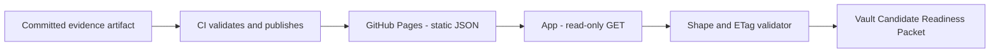

# Hosted Evidence Endpoint — Target Decision: Option A

> ⚠️ **Research prototype. Not audited. Testnet/local only. No real funds.**
> This is a **docs/spec/decision** document. It deploys nothing, adds no server,
> no infrastructure, no secrets, and no API keys. It selects the deployment target
> for a future hosted, read-only evidence endpoint following the
> [deployment plan](Hosted_Evidence_Endpoint_Deployment_Plan.md).

This document selects **Option A — Static JSON from GitHub Pages or an equivalent
static host** as the initial deployment target for the hosted evidence endpoint.

The [deployment plan](Hosted_Evidence_Endpoint_Deployment_Plan.md) documented four
acceptable options (A–D) without selecting one, and gated the selection on a separate,
reviewed PR. This is that PR.

## Purpose

Select a concrete deployment target for the hosted evidence endpoint so the
implementation PR can proceed. The target is chosen to be:

- the simplest path that satisfies all read-only and safety boundaries,
- deployable without new server infrastructure, secrets, or API keys,
- safe to iterate on before a full security review of a runtime transport,
- congruent with the endpoint contract: committed static artifact, ETag-cacheable.

## Non-goals

This document does **not**:

- deploy the endpoint or write any server code,
- add GitHub Pages configuration, CI publishing workflows, infrastructure, secrets,
  API keys, or credentials,
- add private-app runtime fetching, implement feature-flag gating, or change any
  contract semantics,
- run a prover, send transactions, or mutate on-chain state,
- introduce mainnet, change contracts, or change evidence semantics,
- supersede or weaken the security boundaries stated in the deployment plan.

## Selected target

**Option A — Static JSON from GitHub Pages or an equivalent static host** is selected
as the initial deployment target.

The committed `walletwall.zk-adapter-evidence-response.v1` example response
(`evidence/zk/zk-adapter-evidence-response.example.json`) is published at a stable,
versioned static URL via GitHub Pages or an equivalent static host.

The endpoint serves the pre-committed artifact byte-for-byte. No generation, signing,
or computation occurs at request time. The `ETag` is derived from the committed bytes;
the `If-None-Match` / `304` contract is honored by the static host's native headers.

## Why Option A

Option A is selected because:

1. **No server required.** The evidence artifact is already committed and deterministic.
   Option A requires no new runtime, no deployment target to own, and no on-call
   surface beyond the static host.

2. **No secrets or credentials.** A static JSON file served over HTTPS requires no API
   key, no signing key, and no service account. The safety boundary — no credentials in
   the hosting layer — is satisfied by construction.

3. **Artifact is already the right shape.** The committed `*.example.json` is a valid,
   drift-checked, ETag-carrying endpoint response validated by `validate:zk-response`.
   A static host can serve it as-is; no adapter code runs at request time.

4. **Simplest path to ETag caching.** GitHub Pages and most equivalent static hosts
   honor `If-None-Match` / `304` for static files natively. The cache contract defined
   in the deployment plan is achievable without custom middleware.

5. **Lowest blast radius.** A static file can be validated, reviewed, and rolled back
   by updating the committed artifact. The attack surface is minimal: no exec path,
   no query-parameter injection, no hot code path.

6. **Smallest security review scope.** Reviewing a static-hosting configuration and a
   CI publish step is substantially simpler than reviewing a serverless function or a
   hosted verifier service, making it the most appropriate first step.

The deployment plan's rollout phases remain unchanged: local artifact validation →
static hosting preview → read-only staging → app feature-flag validation →
production endpoint approval. Option A covers the first three phases natively.

## Options deferred

**Option B — Serverless read-only endpoint** is deferred. It provides more precise
control over cache and response headers and can implement the `304` contract exactly,
but it introduces runtime code, a deploy target to own, and an abuse surface that
requires rate limiting, monitoring, and a broader security review. Option A achieves
the required contract without those costs. Option B can be adopted later if the
static-host `If-None-Match` behavior proves insufficient.

**Option C — CDN / static object hosting** is deferred. It provides stronger caching
guarantees and global distribution, but those properties are not yet needed for an
evidence artifact that changes rarely. GitHub Pages or an equivalent static host is a
sufficient, simpler starting point. Option C can be adopted later without changing
the endpoint contract or the app-consumption model.

**Option D — Hosted verifier service** is deferred indefinitely until the go/no-go
criteria in the [hosted verifier demo spike](Hosted_Verifier_Demo_Spike.md) are met and
a separate security review of the transport wrapper is completed. It is materially larger
in surface area and remains out of scope for the initial hosted endpoint.

## Required controls

These controls must all be satisfied before any live publish proceeds (implementation
PR):

1. **GET-only.** The static host must serve the artifact via HTTPS only, with no
   write-accessible path. Non-GET methods must return `405` or be refused by the host.

2. **No secret or credential.** The hosting layer reads no API key, no signing key, and
   no private key. The published file is the committed static artifact.

3. **Exact artifact.** The published JSON must be byte-for-byte the committed
   `evidence/zk/zk-adapter-evidence-response.example.json`, validated by
   `npm run validate:zk-response` immediately before publish.

4. **ETag provenance.** The `etag` field in the served JSON must equal
   `keccak256(canonical adapter JSON)`. This is verified by `validate:zk-response`;
   the static host must not modify the file.

5. **Long-lived cache and strong ETag headers.** The static host must serve the
   artifact with `Cache-Control` max-age ≥ 1 hour and an `ETag` or `Last-Modified`
   header allowing conditional-GET revalidation.

6. **HTTPS only.** No plain-HTTP endpoint may serve the artifact.

7. **Versioned path.** The published URL must include a schema-version or artifact-hash
   component so a stale app consumer can detect version drift.

8. **CORS.** If the private app fetches cross-origin, CORS must allow read-only GET
   from the app origin only. No wildcard origin is permitted in production.

9. **CI gate.** A CI step must regenerate, validate, and publish the artifact on every
   merge to main. The publish step must fail if `validate:zk-response` fails.

10. **Limitations block preserved.** The served artifact must retain the `limitations[]`
    block from the committed example. The static host must not strip or alter it.

## Rollout gate

The implementation PR may only proceed after:

- This target-decision PR is reviewed and merged.
- The Rust implementation-path PR (if applicable to the artifact generation path) is
  reviewed and merged.
- All required controls listed above are satisfied in the implementation PR diff.

No part of the hosted endpoint may go live before the security-review gate below.

## Security-review gate

No production endpoint may be activated before a security review covers:

- The static-hosting configuration: headers, CORS, HTTPS redirect, published path.
- The CI publish step: trigger conditions, artifact provenance, write-access scope.
- Confirmation that no secret, key, or credential is reachable from the publish path.
- Confirmation that `validate:zk-response` runs and blocks publish on failure.
- The app feature-flag gating and safe-fallback path.

The security review is **not** in scope for this decision PR. It is a hard gate on
the implementation PR and on production endpoint activation.

## App-consumption boundary

The private WalletWall app may consume the hosted endpoint read-only, behind a feature
flag, subject to the following non-negotiable boundaries. All boundaries from the
deployment plan are unchanged:

- **GET-only.** The app performs only GET requests to the endpoint.
- **No wallet data is sent** to the endpoint.
- **No credentials** are sent from the app to the endpoint.
- **No private keys** are read, held, or transmitted by the app when consuming the
  endpoint.
- **No transactions** are produced or sent.
- **No deploys** are performed as a result of consuming the endpoint.
- **No on-chain writes** occur as a result of consuming the endpoint.
- **No proving in the private app** — the app never executes a prover as a result of
  consuming the endpoint.
- **No mutation endpoint** exists; the app has no POST/PUT/PATCH/DELETE surface on
  the hosted endpoint.
- **No user-specific evidence** is served; the endpoint serves only the committed,
  deterministic artifact.
- **No mainnet custody claims** result from consuming this endpoint. Mainnet stays
  gated by audit, funding, legal, and operational controls.
- **No production ZK claims** result from consuming this endpoint; the served adapter
  is not a proof and not production ZK verification.
- **Safe fallback.** If the endpoint is unreachable, returns a non-200, or fails schema
  validation, the app falls back to its committed/local reference copy and shows no
  degraded claim.

## Acceptance criteria

This decision PR is complete when:

- [ ] The target-decision document exists at
      `docs/Hosted_Evidence_Endpoint_Target_Decision.md`.
- [ ] Option A is selected with documented rationale.
- [ ] Options B, C, and D are explicitly deferred with documented reasons.
- [ ] All required controls for Option A are listed.
- [ ] The rollout gate and the security-review gate are stated.
- [ ] The app-consumption boundary restates all safety boundaries from the deployment
      plan, confirming they are unchanged.
- [ ] The doc carries the prototype/testnet/not-audited/no-real-funds disclaimer and
      uses no forbidden overclaim language in affirmative form.
- [ ] The README documentation map points to this decision.
- [ ] The docs guard test for this decision passes, and existing tests still pass.
- [ ] `package.json` is bumped one patch version.

A production endpoint activation requires a separate implementation PR and a security
review of the static-hosting configuration. Neither is in scope here.

## Related

- [Hosted evidence endpoint deployment plan](Hosted_Evidence_Endpoint_Deployment_Plan.md) —
  the preceding plan: contract, artifact generation, validation, cache/ETag, app
  consumption, all four options, security boundaries, rollout phases.
- [ZK adapter evidence endpoint](ZK_Adapter_Evidence_Endpoint.md) — the in-process
  contract on which the hosted endpoint is based.
- [WalletWall app boundary](WALLETWALL_APP_BOUNDARY.md) — the full read-only boundary
  the private app must observe.
- [Hosted verifier demo spike](Hosted_Verifier_Demo_Spike.md) — Option D preconditions
  and go/no-go criteria.
