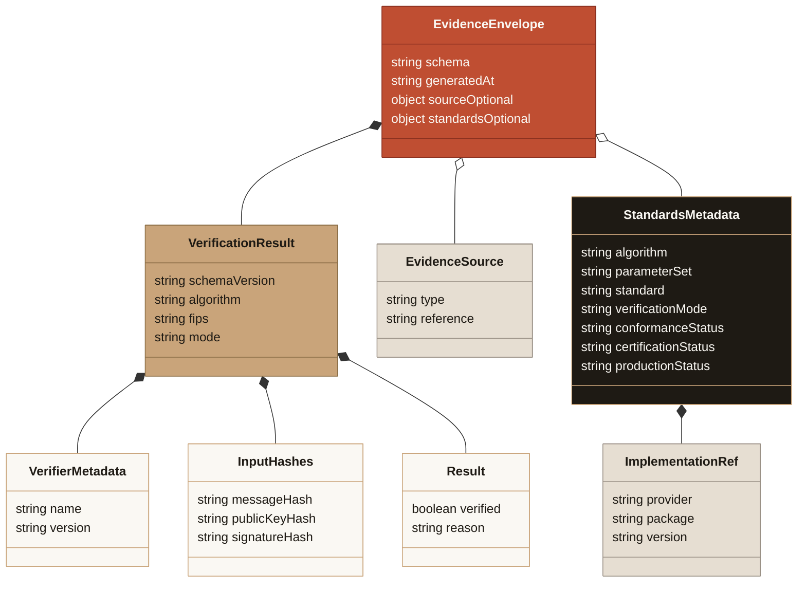

# PQ Verifier Evidence Artifact

> ⚠️ **Research prototype. Not audited. Testnet/local only. Do not use real funds.**
> This artifact is **verification evidence only** — it is **not** a signature, **not** an
> EIP-712 attestation, **not** a ZK proof, and **not** on-chain verification. It does not
> custody funds and does not make this repository production-ready.

The open PQ verifier ([`src/verifier/`](../src/verifier/)) returns a deterministic
[`PQVerificationResult`](Verifier_Result_Schema.md) carrying only keccak256 **hashes** of
the inputs. The **evidence artifact** wraps that result in a small, stable, timestamped
envelope that the private WalletWall app (or any third party) can store and display
**read-only**, plus a dependency-free validator so consumers can reject anything malformed
or carrying raw key material.

- **Module:** [`src/verifier/evidence.ts`](../src/verifier/evidence.ts)
- **JSON Schema:** [`docs/schemas/pq-verifier-evidence.v1.schema.json`](schemas/pq-verifier-evidence.v1.schema.json) (Draft 2020-12)
- **Examples:** [`docs/schemas/examples/`](schemas/examples/) — one verified, one failure
- **Generator:** `npm run evidence:fixtures` (writes the examples)

## Shape

```jsonc
{
  "schema": "walletwall.pq-verifier-evidence.v1", // stable envelope id
  "generatedAt": "2026-01-01T00:00:00.000Z", // ISO-8601 UTC; the ONLY non-deterministic field
  "verification": {
    // the deterministic inner result, verbatim
    "schemaVersion": "walletwall.pq-verifier.v1",
    "verifier": { "name": "walletwall-vault-pq-verifier", "version": "0.1.0" },
    "algorithm": "ML-DSA-65",
    "fips": "FIPS-204",
    "mode": "pure",
    "input": {
      "messageHash": "0x…", // keccak256(message)
      "publicKeyHash": "0x…", // keccak256(publicKey)
      "signatureHash": "0x…", // keccak256(signature)
    },
    "result": { "verified": true, "reason": "ML_DSA_65_VALID" },
  },
  "source": {
    // optional, safe provenance
    "type": "nist-acvp", // nist-acvp | library-generated | operator-supplied
    "reference": "NIST ACVP ML-DSA-65 sigVer tcId 35 (FIPS 204, external/pure)",
  },
}
```

The evidence envelope is intentionally smaller than an attestation. It carries verifier
status and hashes for read-only display; any trusted attestation metadata remains a
separate boundary and is not embedded in this artifact.



The deterministic verification result is nested **verbatim** under `verification`, keeping its
own `walletwall.pq-verifier.v1` schema. The envelope adds `generatedAt`, an optional
`source`, and an optional standards-alignment snapshot. Missing standards metadata is not
a positive conformance, certification, or production-readiness claim. The reason codes are the verifier's closed set
(see [Verifier_Result_Schema.md](Verifier_Result_Schema.md)).

## Safety boundary

- **Hashes only.** The artifact contains keccak256 hashes of the message, public key, and
  signature — never the raw bytes. Both `buildEvidence` and `validateEvidence` reject any
  embedded hex run longer than a 32-byte hash, so raw key/signature material can never be
  carried (even inside `source.reference`).
- **No private material, no signing.** Producing evidence never reads `ATTESTOR_PRIVATE_KEY`
  or any environment variable and never signs anything. The evidence module is covered by the
  open-verifier boundary guards in [`test/PQVerifierBoundary.test.ts`](../test/PQVerifierBoundary.test.ts).
- **Not trust-bearing.** `verified: true` means _the open ML-DSA-65 verifier checked this
  signature_, nothing more. It is not an attestation, not a ZK proof, and not on-chain
  verification. See [Verifier_Roadmap.md](Verifier_Roadmap.md) for the trust model.

## How the private app should consume it (read-only)

1. **Validate first.** Treat any incoming artifact as untrusted input. Reject it unless it
   passes the schema. In this repo the authoritative check is `validateEvidence(value)` from
   `src/verifier/evidence.ts`; an external app may validate against the shipped JSON Schema
   with its own validator. The TypeScript validator is canonical if the two ever disagree.
2. **Display, do not act.** Surface `verification.result.verified`, `verification.result.reason`,
   the three input hashes, `verifier.name@version`, `generatedAt`, and (if present)
   `source.reference`. This is status/evidence for a UI — it must not gate custody, deposits,
   withdrawals, or any fund movement.
3. **Never imply more than it says.** Do not label the artifact as an attestation, a proof,
   "on-chain verified", "quantum-proof", or production custody. Pair it with the boundary
   language in [WALLETWALL_APP_BOUNDARY.md](WALLETWALL_APP_BOUNDARY.md).
4. **Re-verify if you need trust.** The artifact is reproducible: an operator can re-run the
   open verifier on the same inputs and compare hashes/result. The artifact is a convenience
   record, not a substitute for independent verification.

## Producing and validating

```bash
# Regenerate the committed examples (deterministic except the fixed timestamp).
npm run evidence:fixtures
```

```ts
import { verifyMLDSA65Detailed } from "./src/verifier/ml-dsa-65";
import { buildEvidence, validateEvidence } from "./src/verifier/evidence";

const result = verifyMLDSA65Detailed(publicKey, message, signature);
const evidence = buildEvidence(result, {
  source: { type: "operator-supplied", reference: "my run 2026-..." },
});

const check = validateEvidence(evidence);
if (!check.valid) throw new Error(check.errors.join("; "));
```

Schema, examples, and code are kept in sync by [`test/PQEvidence.test.ts`](../test/PQEvidence.test.ts):
the committed examples must equal what the generator builds, both must validate, and the JSON
Schema's reason/source enums must match the code's constants.

## Related

- [Open_PQ_Verifier.md](Open_PQ_Verifier.md) — the verifier boundary and CLI.
- [Verifier_Result_Schema.md](Verifier_Result_Schema.md) — the inner deterministic result.
- [Verifier_Roadmap.md](Verifier_Roadmap.md) — trust model and verifier paths.
- [WALLETWALL_APP_BOUNDARY.md](WALLETWALL_APP_BOUNDARY.md) — what the app may/may not claim.
