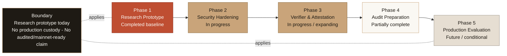

# WalletWall Vault Roadmap

WalletWall Vault is a public research/prototype repository. It explores migration-path
concepts for quantum-aware wallet readiness while staying honest about the current
boundary: local/testnet-oriented, not production custody, not audited, and not safe for
real funds.

The project does not claim exact Q-day timing, production quantum protection, audited
status, or mainnet readiness.

## Current status

WalletWall Vault demonstrates a research path for combining classical Ethereum
authorization with post-quantum verifier interfaces. The prototype includes completed
baseline architecture, security hardening, verifier-governance work, trusted
attestation research, conformance fixtures, and documentation that can be reviewed by
users, investors, design partners, and security reviewers.

Today, the repository should be treated as a local/testnet prototype only. It is useful
for evaluating ideas and implementation tradeoffs, not for custodying real assets or
making production protection claims.

See the [threat model](THREAT_MODEL.md), [WalletWall app boundary](WALLETWALL_APP_BOUNDARY.md),
and [testing guide](TESTING.md) for the current trust assumptions and validation scope.

Proposed near-term research direction: the
[testnet stablecoin vault simulator spec](specs/testnet-stablecoin-vault-simulator.md) extends
the prototype's asset coverage to a mock USDC-style ERC-20 test token while preserving every
existing claim boundary (testnet only, no real value, trusted-attestation PQ gate).

## Roadmap diagram

## Phase 1 - Research Prototype

Status: completed baseline.

- Hybrid ECDSA + PQ verifier-interface experiment.
- Replay-protected EIP-712 withdrawal prototype.
- Trusted attestation path for off-chain ML-DSA verification assumptions.
- Local/testnet validation.
- Initial vault architecture and README.

## Phase 2 - Security Hardening & Review Readiness

Status: in progress / continuing.

Completed or current work:

- EIP-712 replay protection.
- Timelocked verifier governance.
- Verifier cancellation and pending-state improvements.
- Ownership hardening.
- Core test coverage expansion.
- Threat model and testing docs.

Remaining work:

- Expand edge-case and malformed-input tests.
- Improve deployment and runbook documentation.
- Define an explicit audit-readiness checklist.
- Continue reducing governance trust where practical.
- Keep WalletWall app integration read-only and claim-safe.

## Phase 3 - Verifier & Attestation Hardening

Status: in progress / expanding.

Completed or current work:

- Trusted attestation verifier path.
- Off-chain ML-DSA verification assumptions documented.
- Deterministic attestation fixtures.
- ACVP/conformance vector subset.
- ZK/SP1 feasibility documentation.

Remaining work:

- Explore threshold attestor designs.
- Design hardened attestor-service operations.
- Evaluate an SP1/zkVM verification path beyond feasibility documentation.
- Broaden conformance coverage.
- Document verifier tradeoffs.
- Continue avoiding production claims until verifier assumptions and operations are
  resolved.

## Phase 4 - Audit Preparation

Status: partially complete / expanding.

Completed or current work:

- Threat model.
- WalletWall app boundary doc.
- Testing doc.
- Roadmap docs.
- README links.
- CI/test validation.
- Explicit safe/unsafe claims.

Remaining work:

- Prepare for external security review.
- Document deployment procedures.
- Define operational monitoring assumptions.
- Plan incident response.
- Document key-management assumptions.
- Track production blockers explicitly.

## Phase 5 - Production Evaluation

Status: future / conditional.

This phase is conditional. It should be evaluated only after audit, governance
hardening, deployment controls, verifier assumptions, and operational controls are
resolved.

There is no current production custody claim and no current mainnet-ready claim.

## How this relates to the WalletWall app

The private WalletWall app may reference WalletWall Vault as a migration-readiness
research path. The app should treat the vault as a research signal, not a live custody
feature.

The app should remain read-only unless explicitly changed in a future reviewed
integration.

## What is not promised yet

- Production custody.
- Audited status.
- Safe use with real funds.
- On-chain ML-DSA verification today.
- Exact quantum-risk timeline.
- Quantum-proof protection.
- Mainnet deployment.
