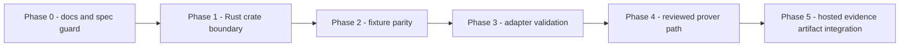

# Rust Implementation Path

> ⚠️ **Research prototype. Not audited. Testnet/local only. No real funds.**
> This is a **docs/spec/decision** document. It deploys nothing, adds no server,
> no infrastructure, no secrets, and no API keys. It describes the bounded,
> offline-safe role Rust may play as an implementation language in the
> `walletwall-vault` toolchain — and the hard limits on what it must not do.

This document is the next step after the
[hosted evidence endpoint target decision](Hosted_Evidence_Endpoint_Target_Decision.md).
That decision selected Option A (static JSON / GitHub Pages or equivalent) as the
initial hosted endpoint target and noted that a Rust implementation-path PR is a
rollout gate before any implementation proceeds. This is that document.

## Purpose

Define the bounded, offline-safe role Rust may play in the
`walletwall-vault` toolchain:

- what Rust is permitted to do,
- what Rust must never do (non-goals),
- where the TypeScript/Rust split lies,
- the phased rollout path for any real Rust tooling,
- the acceptance criteria the first real Rust scaffold PR must satisfy.

This is a planning and boundary-setting document. It does not introduce a new
Rust crate, does not change any existing Rust crate behavior, and does not add
any CI job requiring a Rust toolchain or external network access.

## Rust's approved role

The `zkvm/` directory already contains two small Rust crates:
`zkvm/guest/` (the SP1 ML-DSA-65 zkvm guest) and `zkvm/host/` (the SP1 host /
prover). Their boundaries are narrow and offline-safe. Future Rust work in this
repository must stay within the same narrow, offline-safe perimeter.

Rust is approved for:

- **Deterministic evidence tooling.** Generating or re-deriving committed
  evidence artifacts (manifests, proof inputs, adapter fixtures) from a
  well-defined set of offline inputs in a reproducible, deterministic way.

- **Canonical artifact normalization.** Serializing or normalizing evidence
  artifact JSON to a canonical byte representation that TypeScript-side validators
  can cross-check, without introducing semantic changes to existing artifacts.

- **Proof-input validation.** Checking that a committed SP1 proof-input fixture
  (e.g., `zkvm/fixtures/mldsa65-withdrawal.inputs.json`) satisfies shape, size,
  and hash constraints defined by the ML-DSA evidence manifest, offline, with
  no SP1 toolchain or prover required for the validation pass.

- **Fixture parity checks.** Offline comparison of Rust-derived fixture outputs
  against committed TypeScript-generated equivalents, ensuring both sides agree
  on canonical JSON serialization and field values. Parity checks must not require
  a live prover or any external network call.

- **Offline CLI validation.** A standalone Rust CLI tool that reads a committed
  artifact from disk and exits with a structured result code, analogous to the
  existing TypeScript `validate:*` scripts. No network, no prover, no signing.

- **SP1 adapter boundary support.** Generating or validating the inputs required
  by the SP1 zkvm host (`zkvm/host/`) — withdrawal digest, public key, signature,
  chain id, verifier address — from committed fixtures. Execution of the SP1 guest
  in execute mode (no proof) remains the existing host binary's responsibility.

Within these approved boundaries the role carries hard limits at every phase:
**no app custody**, **no app wallet interaction**, **no default prover execution**.
These limits are stated explicitly in the non-goals section.

No Rust code may reach outside these categories without a separate, reviewed
planning and implementation PR pair.

## Non-goals

Rust must never, in this repository, be used for:

- **Mainnet custody.** No Rust code may hold, receive, generate, or transmit
  private keys, mnemonics, or signing material for mainnet deployments.

- **Production-ZK claims.** No Rust code may produce or verify a real Groth16 or
  other SNARK/STARK proof and assert that proof as a production-custody claim.
  The active on-chain SP1 verifier is a mock; real proving stays behind
  `RUN_SP1_E2E=1`.

- **Private keys.** No Rust code may read, derive, store, log, or transmit any
  private key material, ECDSA signing key, ML-DSA private key, or attestor key.

- **Wallet connection.** No Rust code may open a wallet interface, prompt a user
  for a seed phrase, or interact with any wallet API.

- **Transaction signing.** No Rust code may build, sign, or broadcast a blockchain
  transaction.

- **On-chain writes.** No Rust code may call a contract write function, send ETH,
  or mutate on-chain state.

- **App runtime proving.** No Rust binary may be invoked from within the private
  WalletWall application's runtime. Proving remains a separate, gated operator
  step (see [ZK Prover Runbook](ZK_Prover_Runbook.md)).

- **Network-required prover jobs by default.** Any SP1 prove path (`sp1-sdk`
  `ProverClient::generate_proof`) must remain behind an explicit opt-in environment
  flag (e.g., `RUN_SP1_E2E=1`). No network-required prover job may run in CI
  or by default.

- **Endpoint deployment.** No Rust code may deploy, start, or operate a network
  listener, server, or HTTP service. Evidence artifacts are published by the static
  hosting step described in the
  [target decision](Hosted_Evidence_Endpoint_Target_Decision.md), not by a running
  Rust process.

- **Hosted artifact publishing.** No Rust code may upload or publish an evidence
  artifact to any external host, CDN, GitHub Pages, or object store.

- **Evidence semantic changes.** No Rust code may alter the meaning, schema, or
  field values of any existing evidence artifact type:
  `walletwall.pq-verifier-evidence.v1`,
  `walletwall.ml-dsa-evidence-manifest.v1`,
  `walletwall.sp1-proof-input.v1`,
  `walletwall.zk-verifier-adapter.v1`,
  `walletwall.zk-adapter-evidence-response.v1`, or
  `walletwall.pq-proof-artifact.v1`.

- **Contract or ABI changes.** No Rust code may modify, regenerate, or bypass
  the Solidity contracts, their ABIs, or any deployed contract address.

- **ABI encoding or decoding outside the existing guest journal.** The 160-byte
  SP1 journal ABI encoding already defined in `zkvm/guest/src/main.rs` is the
  canonical Rust ABI surface. No new on-chain ABI surface may be added.

## TypeScript / Rust split

The two languages serve different layers and must not duplicate each other's
responsibilities.

**TypeScript retains full ownership of:**

- All docs guard tests (file existence, heading structure, overclaim checks,
  disclaimer coverage). Docs guards must remain as TypeScript Chai tests run
  by `npm test`; they must not be ported to or replaced by Rust.

- All endpoint response schema checks (JSON Schema validation of
  `*.example.json` files and the `validate:zk-response` drift check). Schema
  validation stays in TypeScript so it runs in CI without a Rust toolchain.

- App-facing JSON contract tests — any test that verifies the structure of an
  artifact the private WalletWall app would consume.

- All existing validator orchestration: `validate:evidence`,
  `validate:sp1-input`, `validate:zk-adapter`, `validate:zk-response`,
  `validate:deployments`, `validate:reproducibility`. These TypeScript scripts
  are the CI-facing source of truth; Rust may complement but must not replace
  them.

- The open PQ verifier (`src/verifier/`), the attestor CLI, all Hardhat
  contract tests, and all existing `scripts/lib/*.ts` logic.

**Rust may later own:**

- Canonical evidence serialization: producing the normalized byte representation
  of an artifact for cross-language hash parity checks, where TypeScript then
  confirms the hash.

- Proof input generation: building a `walletwall.sp1-proof-input.v1` fixture
  from offline inputs and verifying its hashes against the ML-DSA evidence
  manifest from the Rust side, complementing the TypeScript
  `validate:sp1-input` pass.

- Stricter schema validation of Rust-native types at the crate boundary —
  specifically the `GuestInputs` / `InputsFile` types in `zkvm/guest/` and
  `zkvm/host/` — without replacing the JSON Schema checks TypeScript already
  runs.

- Fixture drift detection: comparing a freshly derived Rust artifact against
  the committed JSON fixture, reported as a binary pass/fail, to give a second
  independent cross-check alongside the TypeScript drift check.

- SP1 adapter input preparation: building the exact byte representation the
  SP1 host consumes from the committed proof-input fixture, entirely offline,
  without running the SP1 SDK.

No Rust work in any of these categories may begin without a separate,
reviewed PR targeting that specific category. This document defines
*permission*, not *authorization to implement*.

## Rollout phases

### Phase 0 — Docs / spec / test guard (this PR)

This document and its accompanying docs guard test. No Rust changes.
Deliverable: `docs/Rust_Implementation_Path.md` + `test/RustImplementationPath.test.ts`.

### Phase 1 — Rust crate boundary

Add a new, offline-safe `zkvm/evidence-validator/` (or equivalent) Rust crate
whose only responsibilities are:

- Reading a committed artifact JSON file from disk.
- Checking shape and size constraints defined by the relevant schema.
- Computing keccak256 of selected fields for cross-check against the TypeScript
  `validate:*` output.
- Printing a structured, human-readable result to stdout.
- Exiting zero on success, non-zero on failure.

No network, no prover, no signing, no SP1 SDK build dependency. The crate must
compile and its tests must pass with a plain `cargo test` (no extra flags, no
online dependencies). CI must not require a Rust toolchain by default; the
crate is opt-in offline tooling.

### Phase 2 — Fixture parity

Extend the Phase 1 crate to produce a canonical serialization of the committed
`mldsa65-withdrawal.inputs.json` proof-input fixture, compute its keccak256, and
compare it against the hash recorded by the TypeScript `validate:sp1-input` run.
A mismatch is an error; a match is a pass.

TypeScript still owns the canonical JSON Schema and the CI-facing validation
pass. Rust adds a second, independent cross-check that runs offline.

### Phase 3 — Adapter validation

Extend to read the committed `zk-verifier-adapter.json`, re-derive the
keccak256 of its canonical JSON, and check it against the `etag` field the
TypeScript `validate:zk-adapter` produces. Rust must not change the adapter
semantics; it validates the existing committed artifact, not a new one.

### Phase 4 — Reviewed prover path

Only after all prior phases are reviewed and merged, and only with an explicit
design review, may a PR introduce an opt-in Rust path that runs the SP1 host in
prove mode (`RUN_SP1_E2E=1`) and captures the resulting proof bytes into a
gated fixture. This phase must not run in CI by default. A dedicated
security review of the prover path, key handling, and build reproducibility is
required before any prove-mode output is treated as anything other than a
local test artifact.

### Phase 5 — Hosted evidence artifact integration

Only after Phase 4 is complete, a separate security review of the transport and
artifact publication steps is completed, and the rollout gate from the
[target decision](Hosted_Evidence_Endpoint_Target_Decision.md) is satisfied, may
a PR integrate Rust-produced artifacts into the static hosting publication flow.
This phase is deferred and out of scope for all earlier phases.

## Acceptance criteria for the first real Rust scaffold PR

The first PR that adds or extends Rust code beyond documentation must satisfy
all of the following before merge:

- [ ] The new or changed Rust crate is entirely in `zkvm/` and makes no changes
      to `contracts/`, `scripts/`, `src/`, `pqc/`, or `test/` without a separate
      reviewed reason.

- [ ] `cargo build` in the changed crate succeeds with `--offline` when
      dependencies are cached, or the crate's `Cargo.toml` clearly pins all
      dependencies to exact versions with `=x.y.z` syntax consistent with the
      existing `zkvm/guest/Cargo.toml` and `zkvm/host/Cargo.toml` pinning
      convention.

- [ ] `cargo test` in the changed crate passes with no external network call
      and no SP1 toolchain requirement (execute mode is permitted if the host
      binary is already built; prove mode is not).

- [ ] The PR carries a diff table showing TypeScript validator output before
      and after, confirming no existing `validate:*` script behavior changes.

- [ ] The PR does not introduce any new `unsafe {}` block without a documented
      justification reviewed by at least one other contributor.

- [ ] The PR does not add or change any deployed contract address, ABI, or
      Hardhat deployment configuration.

- [ ] The PR does not modify the JSON schema of any existing evidence artifact
      type.

- [ ] `npm test` still passes (all TypeScript Chai tests).

- [ ] `npm run format:check` still passes.

- [ ] `npm run typecheck` still passes.

- [ ] `npm run lint` still passes.

- [ ] The PR description includes a "Safety boundaries preserved" section
      confirming no non-goal from this document is violated.

## Security boundaries

These boundaries apply to all Rust work in this repository, at every phase:

- No Rust process may hold or transmit private key material.
- No Rust process may perform network I/O by default.
- No Rust process may write or broadcast a transaction.
- No Rust binary may be called from within the private WalletWall app runtime.
- The SP1 guest (`zkvm/guest/`) must not be modified to commit additional public
  values or change the 160-byte journal format without a separate, reviewed
  protocol change that includes a corresponding Solidity `ZKMLDSAVerifier` update
  and a migration plan.
- SP1 prove mode must remain gated behind `RUN_SP1_E2E=1` at every phase and
  must never silently fall back to a mock proof.

## Related

- [Hosted evidence endpoint deployment plan](Hosted_Evidence_Endpoint_Deployment_Plan.md) —
  the preceding plan: artifact generation, validation, cache/ETag, security boundaries.
- [Hosted evidence endpoint target decision: Option A](Hosted_Evidence_Endpoint_Target_Decision.md) —
  selects the static JSON / GitHub Pages target; this document is the Rust
  implementation-path gate that document named.
- [SP1 proof-input scaffold](SP1_Proof_Input.md) — the committed, manifest-aligned
  proof-input fixture Rust tooling may later validate.
- [ZK verifier adapter boundary](ZK_Verifier_Adapter_Boundary.md) — the cross-checked
  adapter artifact Rust tooling may later re-derive and compare.
- [ZK prover runbook](ZK_Prover_Runbook.md) — how to build the SP1 host and run
  the optional prove path; Rust prover work remains gated here.
- [ZK / PQ status matrix](ZK_PQ_Status_Matrix.md) — the single source of truth for
  what exists vs what is claimed across all capability lanes.
- [WalletWall app boundary](WALLETWALL_APP_BOUNDARY.md) — the hard boundary separating
  this public research prototype from the private WalletWall application.
- [SECURITY.md](../SECURITY.md) — prototype status, scope, and reporting.
