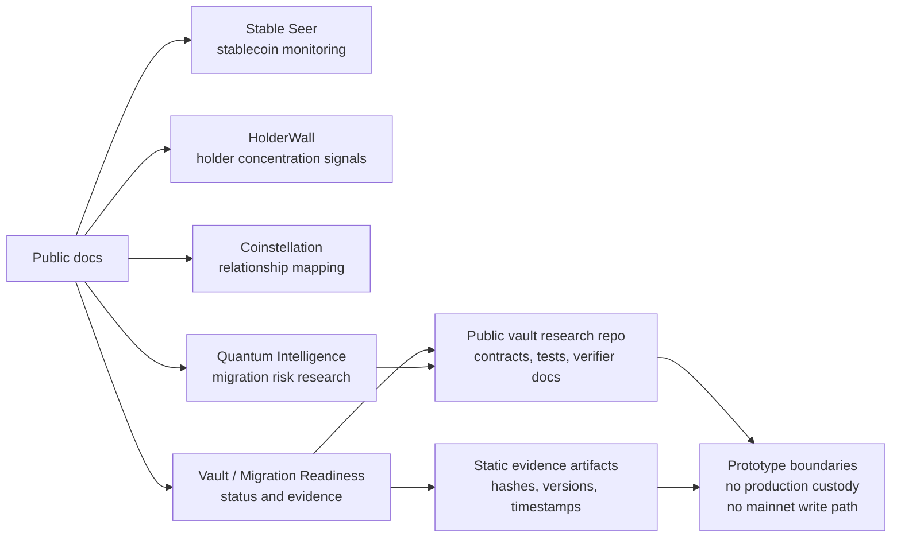
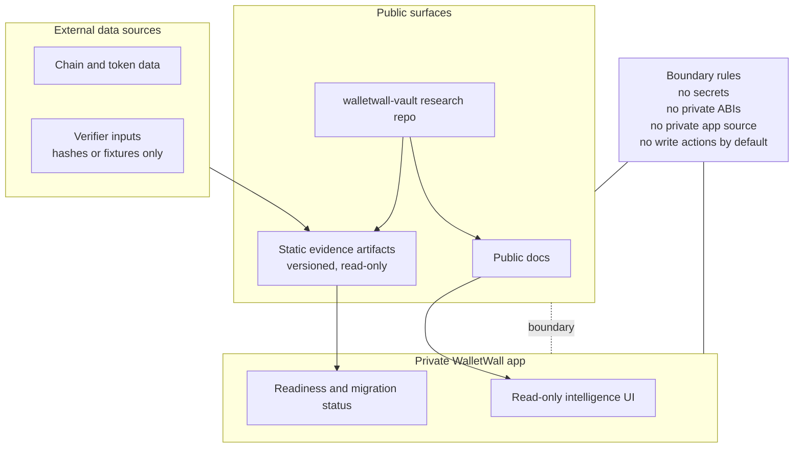
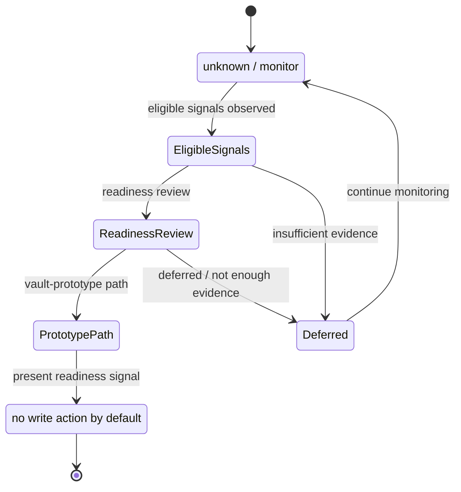

# WalletWall App Boundary

> Research/prototype boundary document. This repository does not contain the private
> WalletWall application and must not copy private app code.

This document explains how the private WalletWall app may safely reference the public
WalletWall Vault repository without implying production custody or production-grade
post-quantum security.

## Repository Boundary

The public `walletwall-vault` repository owns:

- Solidity prototype contracts.
- Local/testnet scripts.
- Mock and trusted-attestation verifier examples.
- Research documentation for verifier migration paths.
- Tests for the public prototype.

The public WalletWall production app surfaces remain read-only wallet intelligence,
readiness, status, and rehearsal visibility. A local, Hardhat, Docker, or Sepolia
simulator flow documented here is an isolated developer/testnet rehearsal exception,
not production app behavior, not custody, not a production deposit/withdrawal service,
not real yield, and not a mainnet write path.

The private WalletWall app owns:

- Product UI and user flows.
- WalletWall app copy, routing, analytics, and production app behavior.
- Any funding, marketing, or customer-facing documentation.
- Any integration choices that are not committed to this public repository.

Work in this repository must not copy private app source code, private configuration,
private deployment data, customer data, or internal operational procedures.

## Public-Safe Surface Map

This repository can support public documentation about WalletWall readiness and
migration research without exposing private app implementation details. The product
surface labels below are public-facing concepts, not a map of private routes, private
state, or runtime data providers.

## Public / Private Boundary

Use this repository as a public evidence and research boundary. Do not use it as a place
to publish private app source, private ABIs, secrets, operational credentials, customer
data, or write-capable app behavior.

## Vault Readiness States

Readiness language should stay status-oriented. A readiness signal can support review,
monitoring, or rehearsal, but it is not a default instruction to deposit, withdraw, sign,
or send a transaction.

## What the App May Safely Say

The private app may reference this repository as:

- A public research prototype.
- A local/testnet vault experiment.
- A migration-path exploration for hybrid ECDSA plus post-quantum authorization.
- A contract and verifier-boundary research artifact.
- A place where future verifier strategies can be evaluated before any production
  claims are made.

Suggested wording:

> WalletWall is researching a vault migration path that combines existing Ethereum
> signatures with a post-quantum verifier interface. The current public vault repo is a
> research prototype for local and testnet evaluation, not production custody.

## What the App Should Avoid Saying

The private app should not say or imply that this repository is:

- Production-ready.
- Audited.
- Safe for real funds.
- A launched custody product.
- Quantum-proof.
- Immune to a future quantum-capable adversary.
- Backed by on-chain ML-DSA verification today.
- A guarantee against any exact "Q-day" date or timeline.
- A substitute for wallet hygiene, multisig governance, or operational security.
- A production deposit or withdrawal service.
- A source of real yield, interest, APY, rewards-as-returns, or income.
- A mainnet production write path.

Avoid wording such as:

- "Protects assets from quantum attacks today."
- "Production quantum-safe vault."
- "Audited post-quantum custody."
- "Prevents all future quantum risk."
- "Ready for mainnet deposits."
- "Users can deposit into WalletWall for yield."
- "Production withdrawals are live."

## Integration Guidance

If the private app links to this repository:

- Link to the README, `docs/THREAT_MODEL.md`, and `docs/Verifier_Roadmap.md`.
- Label any vault flow as research, prototype, local, or testnet unless a future audited
  production design replaces these assumptions.
- Show a clear "do not use real funds" warning around any local/testnet vault demo.
- Distinguish mock verification from trusted attestation and future verifier paths.
- Treat the attestor path as trusted infrastructure, not trustless PQ verification.
- Avoid showing demo keys or fixture material as real user credentials.

## No Custody Claims

This repository does not establish a custody relationship with users and does not make
custody guarantees. It contains prototype contracts that account for ETH deposited into
vault records during local/testnet evaluation. That is not the same thing as a reviewed
production custody system.

Any future production custody or migration product would need separate design, threat
modeling, audits, operational controls, incident response, deployment review, and user
documentation.

## Boundary for Future Work

The app may use this repository to frame a staged migration story:

1. Research the hybrid authorization model.
2. Evaluate mock and trusted-attestation verifier boundaries on local/testnet networks.
3. Replace trusted or mock paths with stronger verifier designs, such as ZK proof
   verification or chain-native support, if they become practical and reviewed.
4. Reassess claims only after implementation, audit, deployment, and operational
   controls exist.

Until those steps are complete, references should remain prototype-scoped.
